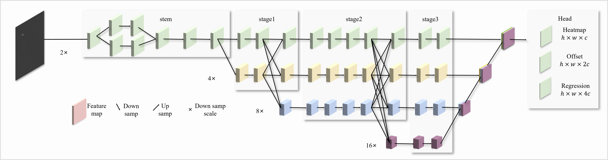
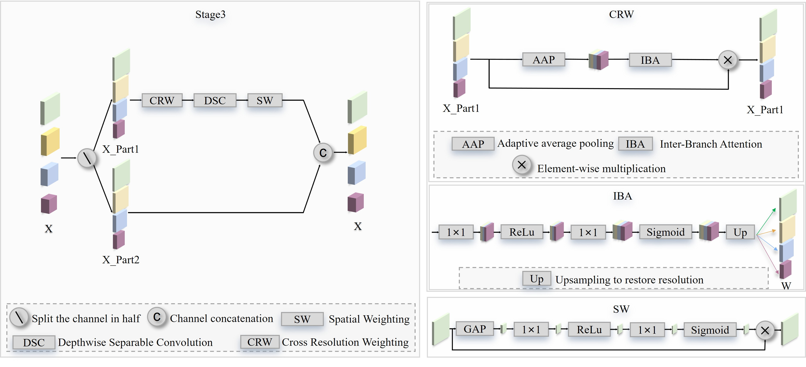

# ITD
## Infrared Tiny Target Detection  

# Datasets sources
[SIRST](https://github.com/YimianDai/sirst)
[IRSTD-1k](https://github.com/RuiZhang97/ISNet)
[ITT-2_15-original](https://drive.google.com/drive/folders/166iNTmKyahH7TPzSQjt5-1j4BEX9uw-Z?usp=drive_link)
[ITT-2_15-annotations](https://drive.google.com/drive/folders/166iNTmKyahH7TPzSQjt5-1j4BEX9uw-Z?usp=drive_link)

## Prerequisites
-mmcv	2.1.0  
-mmdet	3.3.0  
-mmengine	0.10.7   
-numpy	1.26.4  
-opencv-python	4.11.0.86  
-torch	2.6.0+cu126  
-torchvision	0.21.0+cu126

## Model Architecture

## Det Results

| Models         | mAP   | mAP50 | Recall | FLOPs   | Params  | FPS  | weight |
|----------------|-------|-------|--------|---------|---------|------|------|
| Faster RCNN  | 0.413 | 0.543 | 0.470  | 134 G   | 41.0 M  | 20   | [[Link](https://drive.google.com/file/d/18wmWKM3wMBQsusOR-_bGAu5l967Qp4TT/view?usp=drive_link)] |
| YOLOv5s     | 0.437 | 0.644 | 0.543  | 15.9 G  | 7.02 M  | 185.1| [[Link](https://drive.google.com/file/d/1Zc6vh_ebHxBzhAYzD4CwHPdxZ5C7dXI6/view?usp=drive_link)] |
| FCOS      | 0.006 | 0.010 | 0.003  | 31.1 G  | 7.90 M  | 5.6  | [[Link](https://drive.google.com/file/d/16NHHye-mrGNqF2YLsRVW_zbEXqiWHGjx/view?usp=drive_link)] |
| CenterNet  | 0.238 | 0.422 | 0.311  | 0.59 G  | 1.09 M  | 32.4 | [[Link](https://drive.google.com/file/d/1uZfBVTt1hujrhJfklFBzYDHqp6Z5ZTLL/view?usp=drive_link)] |
| L-FFCA-YOLO  | 0.440 | 0.633 | 0.538 | 37.6 G  | 5.05 M  | 90.9 | [[Link](https://drive.google.com/file/d/1duJ_wfHjU0tufVW6IOUetGHHdFg4LWRd/view?usp=drive_link)] |
| YOLOv5s-S2  | 0.605 | 0.745 | 0.672 | 22.0 G  | 7.23 M  | 129.8| [[Link](https://drive.google.com/file/d/1MZbxsVl_1wDNp98JHT9LrFgAU3Le3iZt/view?usp=drive_link)] |
| EFLNet     | 0.205 | 0.349 | 0.306  | 8.24 G  | 33.0 M  | 12.5 | [[Link](https://drive.google.com/file/d/1PCFJrI1Ed-VzPbGRh7gnHQBdEmOx7fqU/view?usp=drive_link)] |
| **Ours**     | **0.817** | **0.868** | **0.859** | **2.04 G** | **1.17 M** | **30.8** | [[Link]](https://drive.google.com/file/d/12rnfe5RM-S9DIhr1NXlQ3nLAWZC6YT68/view?usp=drive_link) |

| Datasets    | Models           | Precision | Recall | F1    |
|-------------|------------------|-----------|--------|-------|
| **SIRST**   | MDvsFAcGan  | 0.845 | 0.507  | 0.597 |
|             | ALCNet  | 0.848 | 0.780  | 0.812 |
|             | ACMNet | 0.765 | 0.762  | 0.763 |
|             | DNANet | 0.847 | 0.836  | 0.844 |
|             | EFLNet | 0.882 | 0.858  | 0.870 |
|             | UIUNet | 0.865 | 0.841  | 0.852 |
|             | **Ours** | **0.990** | **0.988** | **0.989** |
| **IRSTD-1k**| MDvsFAcGan | 0.837 | 0.648  | 0.730 |
|             | ALCNet | 0.843 | 0.656  | 0.738 |
|             | ACMNet | 0.880 | 0.883  | 0.866 |
|             | DNANet | 0.829 | 0.880  | 0.844 |
|             | EFLNet | 0.870 | 0.817  | 0.844 |
|             | UIUNet | 0.859 | 0.873  | 0.866 |
|             | **Ours** | **0.964** | **0.927** | **0.945** |

### ITT Det Results [[Link](https://drive.google.com/drive/folders/1FeNYnrWnm2C8sX-Op0SCaeTh1X039brR?usp=drive_link)]

### SIRST Det Results [[Link](https://drive.google.com/drive/folders/1r1rSkH82cFFb_X34p4bP2pioBZG1i1uy?usp=drive_link)]

### IRSTD-1k Det Results [[Link](https://drive.google.com/drive/folders/1arjoZB9d5FML-l2309nhO0CadUT7l0zg?usp=drive_link)]

